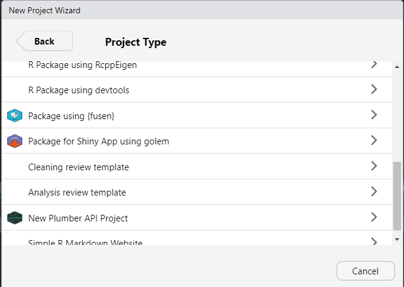
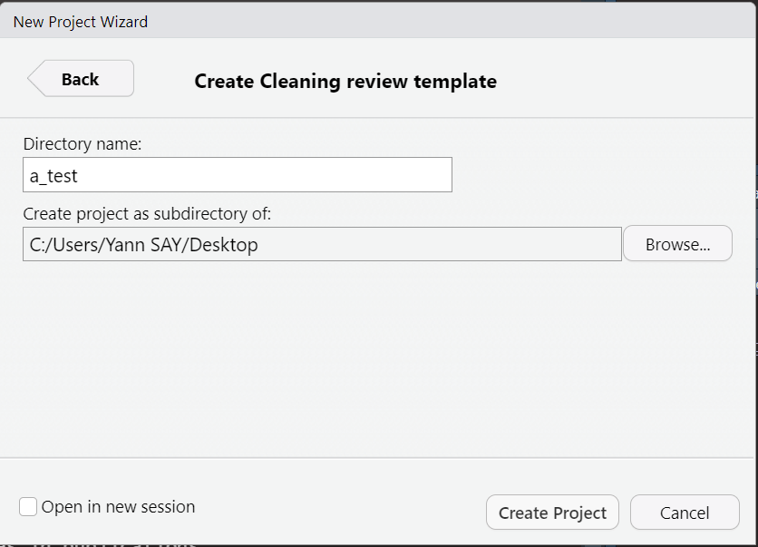
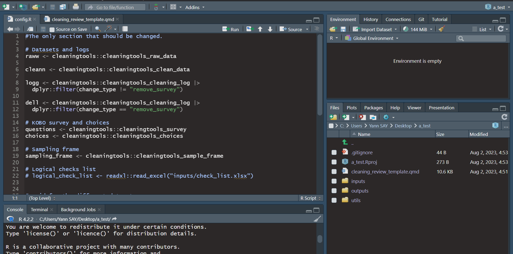
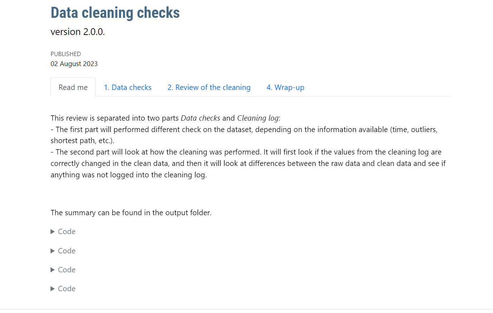

<!-- README.md is generated from README.Rmd. Please edit that file -->

# impacttemplates

<!-- badges: start -->

[](code_of_conduct.md)

[](https://github.com/impact-initiatives/impacttemplates/actions/workflows/R-CMD-check.yaml)
[](https://app.codecov.io/gh/impact-initiatives/impacttemplates?branch=main)
<!-- badges: end -->

The goal of impacttemplates is to create R project from templates for
different use.

## Installation

You can install the development version of impacttemplates from
[GitHub](https://github.com/) with:

``` r
# install.packages("devtools")
devtools::install_github("impact-initiatives/impacttemplates")
```

## Example

- Once installed, some project templates will be available in R Studio
  Project Wizard.



### Cleaning review template

- If you select Cleaning review template, you need to give the name of
  the project folder and the subdirectory of it.

[](Create%20a%20cleaning%20review%20template)

- This will create a new folder with your project. It opens a
  **config.R** file where you can input several information such as :

  - where to find the datasets (suggestion is to use the input folder of
    the project)

  - KOBO information

  - Sampling frame

  - Logical checks list

  - names of the uuid columns

  - names of the cleaning log

  - select multiple separator

  - sampling frame information

Don’t forget to save.



- There is then a quarto file **cleaning_review_template.qmd**

- You can click on render to render a file.

  - There is a box where you can add or remove tests (with TRUE and
    FALSE). You can add or remove either if you want just to check
    quickly something or because the template/functions are not working.


- Once render, this will create an html output that you can navigate to
  read the results of the checks and review. It will also write an excel
  file in your outputs folder with the clean dataset reviewed and any
  indicators added, all the checks, and review.




## Code of Conduct

Please note that the impacttemplates project is released with a
[Contributor Code of
Conduct](https://impact-initiatives.github.io/impacttemplates/CODE_OF_CONDUCT.html).
By contributing to this project, you agree to abide by its terms.
